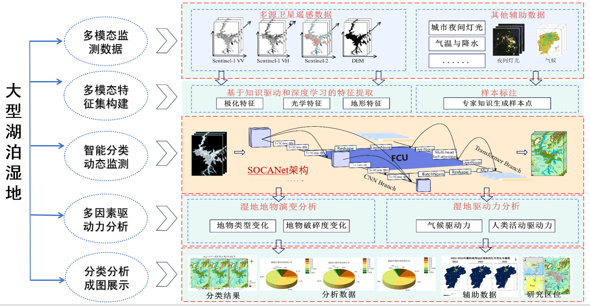
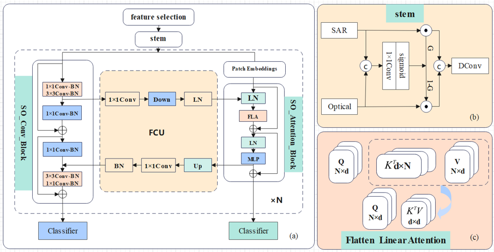
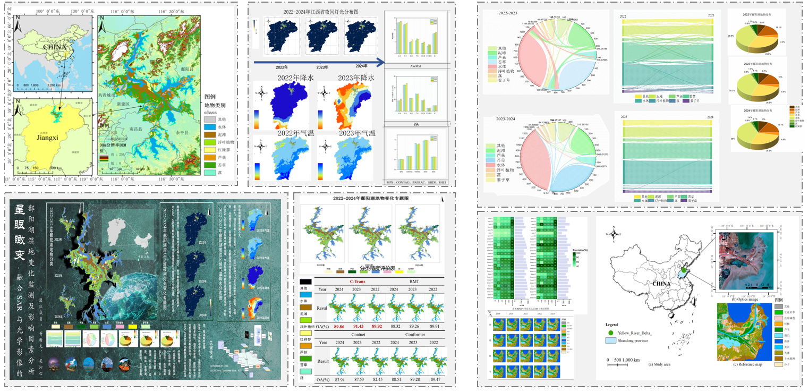
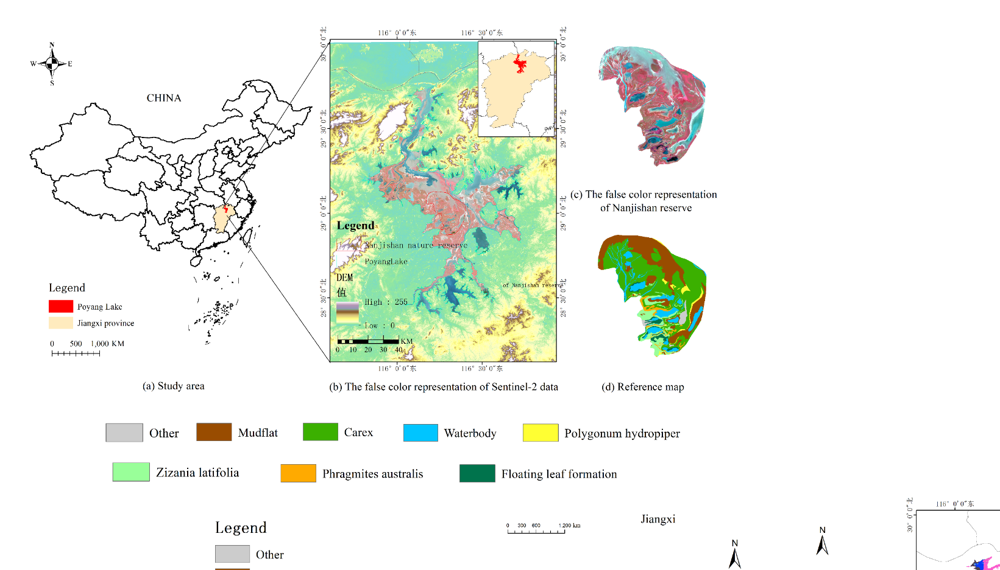

<<<<<<< HEAD
# SOCANet: A Deep Learning Wetland Classification Strategy Based on Improved CNN and Attention Mechanism

<p align="center">

</p>

<p align="center">
Official implementation of <b>SOCANet</b> for wetland classification using multi-source remote sensing data.
</p>

---

## 📄 Paper

SOCANet: A Deep Learning Wetland Classification Strategy Based on Improved CNN and Attention Mechanism

Paper link:

[Read Paper]([SOCANet: A Deep Learning Wetland Classification Strategy Based On Improved CNN and Attention Mechanism | IEEE Conference Publication | IEEE Xplore](https://ieeexplore.ieee.org/document/11242976))

---

## 🚀 Method Overview

SOCANet is a hybrid deep learning framework that integrates **CNN** and **Linear Self-Attention** to improve feature representation in complex wetland environments.

Key contributions:

- Cross-modal feature fusion for SAR and optical images  
- Multi-level feature extraction architecture  
- Linear attention for efficient global feature modeling  
- Improved wetland classification performance  

---

## 🧠 Model Architecture

<p align="center">

</p>

The architecture contains:

- Cross-modal Feature Fusion Module  
- CNN Feature Extraction Branch  
- Focused Linear Attention Branch  
- Dual Classifier Decoder  

---

## 📊 Experimental Results

<p align="center">

</p>

SOCANet achieves state-of-the-art performance on the Nanjishan Wetland dataset.

| Method      | OA        | Kappa     |
| ----------- | --------- | --------- |
| RMT         | 74.02     | 0.637     |
| CoAtNet     | 95.28     | 0.935     |
| Conformer   | 96.28     | 0.949     |
| **SOCANet** | **97.00** | **0.959** |

---

## 🎬 Demo

<p align="center">

</p>

Example classification visualization of wetland land-cover types.

---

## 📂 Project Structure

```text
SOCANet
│
├── datasets
├── models
├── train.py
├── test.py
├── utils.py
├── requirements.txt
└── README.md
```


## 1. Introduction

Wetland ecosystems play a critical role in global climate regulation, biodiversity conservation, and ecological restoration. Accurate classification of wetland land cover types is essential for environmental monitoring and sustainable management.

This repository provides the implementation of **SOCANet**, a hybrid deep learning framework designed for wetland classification using multi-source remote sensing data.

SOCANet integrates **Convolutional Neural Networks (CNN)** with **linear self-attention mechanisms**, enabling the model to effectively capture both local spatial features and global contextual information.

The model is designed to process **multi-source remote sensing data**, including optical images and SAR imagery, and performs fine-grained classification of complex wetland environments.

---

## 2. Paper Information

**Title**

SOCANet: A Deep Learning Wetland Classification Strategy Based on Improved CNN and Attention Mechanism

**Authors**

Hanwen Xu, Chang Liu, Qinxin Wu, Zixuan Wang, Zhe Wang, Hongtao Shi

**Affiliation**

School of Environment Science and Spatial Informatics  
China University of Mining and Technology, Xuzhou, China

---

## 3. Method Overview

SOCANet adopts a hybrid architecture that combines CNN-based feature extraction with attention-based global representation learning.

The main components of SOCANet include:

### 1. Cross-modal Feature Fusion Module
This module fuses information from different sensors (SAR and optical images) to alleviate semantic differences between data modalities.

### 2. Multi-level Feature Extraction Module
A parallel structure combining:

- CNN branch for local spatial feature extraction
- Focused Linear Attention branch for global feature modeling

### 3. Encoder–Decoder Framework
The network is divided into two main parts:

- **Encoder:** Extracts hierarchical features from input data
- **Decoder:** Performs classification tasks based on extracted features

---

## 4. Dataset

The model is evaluated on wetland remote sensing data from the **Nanjishan Wetland Nature Reserve**, located in the southern region of **Poyang Lake, Jiangxi Province, China**.

### Data sources

- **Sentinel-1 SAR imagery**
  - VV polarization
  - VH polarization

- **Sentinel-2 multispectral imagery**
  - B2 (Blue)
  - B3 (Green)
  - B4 (Red)
  - B8 (Near Infrared)

### Wetland classes

The dataset includes several wetland land-cover categories:

- Mudflat
- Reeds
- Carex
- Water
- Floating leaf plants
- Wild rice
- Polygonum red
- Other wetland vegetation

---

## 5. 1 Experimental Results

SOCANet achieves superior performance compared with several state-of-the-art models.

| Method      | OA (%)    | Kappa     | IoU (%)   |
| ----------- | --------- | --------- | --------- |
| RMT         | 74.02     | 0.637     | 22.25     |
| CoAtNet     | 95.28     | 0.935     | 76.55     |
| Conformer   | 96.28     | 0.949     | 81.61     |
| **SOCANet** | **97.00** | **0.959** | **84.91** |

The proposed model shows strong capability in distinguishing complex wetland land-cover types.


## 5.2 Ablation Study

To better understand the contribution of each component in SOCANet, we conducted ablation experiments by progressively adding different modules to the baseline model.

The evaluated modules include:

- **DC(front)**: Edge variable convolution applied in the front stage  
- **DC(mid)**: Edge variable convolution applied in the middle stage  
- **GFM**: Cross-modal feature fusion module  
- **FLA**: Focused Linear Attention module  

The experimental results are summarized below.

| P    | DC(front) | DC(mid) | GFM  | FLA  | FLOPs (G) | ACC (%)   |
| ---- | --------- | ------- | ---- | ---- | --------- | --------- |
| ✓    |           |         |      |      | 13.3      | 91.46     |
|      | ✓         |         |      |      | 13.4      | 92.25     |
|      |           | ✓       |      |      | 4.4       | 86.76     |
|      |           |         | ✓    |      | 13.5      | 92.64     |
|      |           |         |      | ✓    | 3.4       | 91.47     |
| ✓    | ✓         |         | ✓    | ✓    | —         | **93.10** |

These results indicate that each component contributes to the final performance of the model. In particular, the **cross-modal feature fusion module (GFM)** and the **focused linear attention (FLA)** significantly improve classification accuracy. The combination of all modules leads to the best performance.

---

## 6. Project Structure


```
SOCANet
│
├── datasets
│   ├── optical
│   └── sar
│
├── models
│   ├── socanet.py
│   └── attention_module.py
│
├── train.py
├── test.py
├── utils.py
│
├── requirements.txt
└── README.md
```

---

## 7. Environment Requirements

```markdown

Python version:

```text
Python 3.9
```

Install dependencies:

```bash
pip install -r requirements.txt
```

---

## 8. Training

Example training command:

```bash
python train.py
```

Training settings:

- Optimizer: Adam
- Training epochs: 50
- Framework: PyTorch

---

## 9. Testing

Run the model evaluation:

python test.py

The model will generate classification maps for wetland land-cover types.

---

## 10. Citation

If you find this repository useful for your research, please cite the following paper:

@INPROCEEDINGS{11242976,

  author={Xu, Hanwen and Wu, Qinxin and Wang, Zhe and Liu, Chang and Wang, Zixuan and Shi, Hongtao},

  booktitle={IGARSS 2025 - 2025 IEEE International Geoscience and Remote Sensing Symposium}, 

  title={SOCANet: A Deep Learning Wetland Classification Strategy Based On Improved CNN and Attention Mechanism}, 

  year={2025},

  volume={},

  number={},

  pages={6513-6516},

  keywords={Representation learning;Accuracy;Land surface;Vegetation mapping;Feature extraction;Decoding;Convolutional neural networks;Optical sensors;Remote sensing;Wetlands;Multi-source remote sensing;SOCANet;Cross-modal feature fusion;Linear attention;Wetland mapping},

  doi={10.1109/IGARSS55030.2025.11242976}}


---

## 11. Contact

For questions, collaborations, or discussions, please contact:

Hanwen Xu  
China University of Mining and Technology  
Email: xuhanwen22@gmail.com

---

## 13. License

This project is released under the MIT License.
=======
# SOCANet
>>>>>>> 6b8c4351b1a1258057d98f294c73c4c4d5992f95
